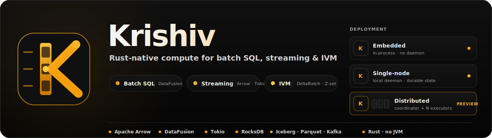

<p align="center">
  
</p>

Krishiv is a Rust-native hybrid compute framework that unifies **batch SQL**,
**streaming pipelines**, and **incremental view maintenance (IVM)** under a
single Apache Arrow / DataFusion engine.

The same plan runs in three shapes — **embedded** in your process, as a
**single-node** daemon, or as a **coordinator-plus-executors** cluster. The
same code reads Parquet, subscribes to Kafka, and writes Iceberg. The same
SQL powers batch reports, real-time aggregations, and incrementally maintained
views.

## Compute Modes

| | **Batch SQL** | **Streaming** | **DeltaBatch (IVM)** |
|---|---|---|---|
| Input | Snapshot `RecordBatch` | Continuous events | Cumulative + per-tick delta |
| Output | Full result set | Windowed results | True incremental delta |
| State | Stateless | Window / watermark | Materialized snapshots |
| SQL | `SELECT … FROM source` | `SELECT … OVER window` | `CREATE INCREMENTAL VIEW` |
| Latency | Query-latency | Sub-second | Tick-latency |
| Use case | Reports, ETL, ad hoc | Real-time aggregations | Live dashboards, derived state |

---

## Features

### Core Engine
- Apache Arrow in-process columnar memory — zero-copy between operators
- DataFusion SQL engine with full `SELECT`, `JOIN`, `GROUP BY`, window functions
- Topological multi-view execution with inter-view MemTable registration
- Pluggable connector SDK (source + sink) with capability and maturity metadata

### Batch SQL (`krishiv-api` / `krishiv-sql`)
- `Session::sql(query)` — one-shot DataFusion query over any registered source
- Schema coercion: projects / casts result columns to declared output schema by name
- `cargo run -p krishiv -- sql --query "..."` CLI for interactive use

### Streaming (`krishiv-dataflow` / `krishiv-connectors`)
- Event-driven pipelines with window semantics (tumbling, sliding, session)
- Watermark-based late-data handling
- `LatenessSpec` per-column lateness tolerance
- Iceberg-first lakehouse sink (Parquet + manifest); Delta Lake and Hudi experimental

### DeltaBatch / Incremental View Maintenance (`krishiv-delta` / `krishiv-api`)
- **`DeltaBatch`** — Arrow `RecordBatch` + `_weight: Int64` column (DBSP Z-set)
  - `DeltaBatch::from_inserts(rb)` — all rows get weight `+1`
  - `DeltaBatch::from_deletes(rb)` — all rows get weight `−1`
  - `DeltaBatch::from_update(before, after)` — retraction + insertion pair
  - `DeltaBatch::from_weighted(rb)` — explicit weight column already present
- **`differentiate(schema, prev, next)`** — diff two snapshots to a `DeltaBatch`
- **`apply_delta(current, delta)`** — apply delta to snapshot; returns new snapshot
- **`IntegrateOp`** — stateful accumulator: repeated `apply_delta` across ticks
- **`IncrementalFlow`** — multi-view IVM session:
  - `feed_source(name, delta)` — enqueue per-tick source delta (coalesced)
  - `step_datafusion()` — run one tick: cumulative snapshots → SQL → diff → publish
  - `register_view(name, sql, schema)` — add/replace a view (behavior-version invalidation)
  - `watch_view(name)` — `watch::Receiver<Option<DeltaBatch>>` for live output
  - `snapshot(name)` — current materialized state of any view
  - `checkpoint() / restore(&[u8])` — Arrow IPC binary checkpoint with length-prefix framing
  - `drop_view(name)` — remove a view at runtime
  - `source_snapshot(name)` — inspect the current cumulative source state
- **Topological sort** (Kahn's algorithm) — views referencing other views execute after
- **Behavior-version invalidation** — `register_view` on existing name resets the diff baseline
- **Coalescing pending** — multiple `feed_source` calls per source per tick are merged

### Lakehouse
- Iceberg catalog integration (REST, Hive, Glue)
- Parquet read/write with column pruning and predicate pushdown
- Snapshot isolation; time-travel queries

### Deployment
- **Embedded** — library in any Rust or Python process
- **Single-node daemon** — `krishiv-operator` binary with Flight SQL endpoint
- **Distributed** — `krishiv-scheduler` coordinator + `krishiv-executor` workers
- **Kubernetes** — CRD-driven deployment via `krishiv-operator`

### Python Bindings (`krishiv-python`)
- `PyDeltaBatch`, `PyIncrementalFlow` — thin PyO3 wrappers over the Rust API
- `IncrementalFlow.feed_source(name, pyarrow.RecordBatch)`
- `IncrementalFlow.step()` — synchronous tick
- `IncrementalFlow.watch_view(name)` — returns latest `DeltaBatch` from the watch channel

---

## Quick Start

### Prerequisites

```bash
# Rust 1.80+ required
rustup update stable
cargo check --workspace
```

---

### Mode 1 — Batch SQL

**Rust**

```rust
use krishiv_api::Session;

#[tokio::main]
async fn main() -> anyhow::Result<()> {
    let session = Session::new();

    // Register an Arrow RecordBatch as a table
    session.register_record_batch("orders", orders_batch)?;

    // Run SQL — returns RecordBatch
    let result = session.sql("SELECT status, COUNT(*) AS n FROM orders GROUP BY status").await?;

    // Pretty-print via DataFusion
    println!("{:?}", result);
    Ok(())
}
```

**CLI**

```bash
# One-shot query
cargo run -p krishiv -- sql --query "SELECT 1 AS value"

# Explain plan
cargo run -p krishiv -- explain --query "SELECT 1 AS value"

# List registered jobs
cargo run -p krishiv -- jobs
```

**Python**

```python
import pyarrow as pa
import krishiv

session = krishiv.Session()
session.register_table("orders", orders_table)          # pa.Table
result = session.sql("SELECT status, COUNT(*) AS n FROM orders GROUP BY status")
print(result.to_pandas())
```

---

### Mode 2 — Streaming

**Rust**

```rust
use krishiv_api::{StreamSession, WindowSpec};
use std::time::Duration;

#[tokio::main]
async fn main() -> anyhow::Result<()> {
    let mut stream = StreamSession::new();

    // Tumbling 1-minute window on event_time
    stream.register_window(
        "orders_1m",
        "orders",
        WindowSpec::tumbling("event_time", Duration::from_secs(60)),
    );

    // Aggregate within each window
    stream.register_view(
        "order_totals",
        "SELECT window_start, SUM(amount) AS total FROM orders_1m GROUP BY window_start",
    );

    // Receive windowed output batches
    let mut rx = stream.watch("order_totals");
    while let Ok(batch) = rx.recv().await {
        println!("window batch: {} rows", batch.num_rows());
    }
    Ok(())
}
```

---

### Mode 3 — DeltaBatch / Incremental View Maintenance

**Rust — single view**

```rust
use krishiv_api::IncrementalFlow;
use krishiv_delta::DeltaBatch;
use arrow::datatypes::{DataType, Field, Schema};
use std::sync::Arc;

#[tokio::main]
async fn main() -> anyhow::Result<()> {
    let mut flow = IncrementalFlow::new();

    // Declare a view — SQL runs over the cumulative source snapshot
    let out_schema = Arc::new(Schema::new(vec![
        Field::new("status", DataType::Utf8, false),
        Field::new("n", DataType::Int64, false),
    ]));
    flow.register_view(
        "order_counts",
        "SELECT status, COUNT(*) AS n FROM orders GROUP BY status",
        out_schema,
    ).await?;

    // Tick 1 — three new orders arrive
    let inserts = make_orders_batch(&[("pending", 10.0), ("shipped", 25.0), ("pending", 5.0)]);
    flow.feed_source("orders", DeltaBatch::from_inserts(inserts)?).await?;
    let active = flow.step_datafusion().await?;
    println!("tick 1: {} views emitted output", active);

    // Tick 2 — one order status changes (retract old, insert new)
    let before = make_orders_batch(&[("pending", 10.0)]);
    let after  = make_orders_batch(&[("shipped", 10.0)]);
    flow.feed_source("orders", DeltaBatch::from_update(before, after)?).await?;
    let active = flow.step_datafusion().await?;
    println!("tick 2: {} views emitted output", active);

    // Subscribe to live deltas
    let mut rx = flow.watch_view("order_counts")?;
    // rx.changed().await — use in async context
    Ok(())
}
```

**Rust — view referencing another view**

```rust
// Views execute in topological order automatically.
// "summary" can reference "order_counts" — Krishiv detects the dependency.

flow.register_view(
    "order_counts",
    "SELECT status, COUNT(*) AS n FROM orders GROUP BY status",
    counts_schema,
).await?;

flow.register_view(
    "summary",
    "SELECT SUM(n) AS total_orders FROM order_counts",
    summary_schema,
).await?;

// Both views update correctly on each tick.
flow.feed_source("orders", delta).await?;
flow.step_datafusion().await?;
```

**Rust — checkpoint and restore**

```rust
// Serialize the full cumulative state to bytes
let checkpoint: Vec<u8> = flow.checkpoint().await?;

// Restore into a fresh flow (e.g. after process restart)
let mut restored = IncrementalFlow::new();
// re-register views first …
restored.register_view("order_counts", sql, schema).await?;
restored.restore(&checkpoint).await?;

// Next tick continues from the saved state
restored.feed_source("orders", new_delta).await?;
restored.step_datafusion().await?;
```

**Python — DeltaBatch IVM**

```python
import pyarrow as pa
import krishiv

flow = krishiv.IncrementalFlow()

# Register a view
flow.register_view(
    "order_counts",
    "SELECT status, COUNT(*) AS n FROM orders GROUP BY status",
    pa.schema([pa.field("status", pa.utf8()), pa.field("n", pa.int64())]),
)

# Tick 1
orders = pa.record_batch(
    {"status": ["pending", "shipped", "pending"], "amount": [10.0, 25.0, 5.0]},
    schema=pa.schema([pa.field("status", pa.utf8()), pa.field("amount", pa.float64())]),
)
flow.feed_source("orders", krishiv.DeltaBatch.from_inserts(orders))
flow.step()

# Receive the delta for this tick
delta = flow.watch_view("order_counts")
if delta is not None:
    print("insertions:", delta.filter_positive().to_pydict())
    print("retractions:", delta.filter_negative().to_pydict())
```

---

## Deployment

### Embedded library

```toml
# Cargo.toml
[dependencies]
krishiv-api    = { path = "crates/krishiv-api" }
krishiv-delta  = { path = "crates/krishiv-delta" }
```

### Single-node daemon

```bash
cargo build --release -p krishiv-operator
./target/release/krishiv-operator --config config.toml
# Flight SQL endpoint available on :50051
```

### Kubernetes CRD

```yaml
apiVersion: krishiv.io/v1alpha1
kind: KrishivCluster
metadata:
  name: prod
spec:
  schedulers: 1
  executors: 4
  storage:
    rocksdb:
      volumeClaimTemplate:
        resources:
          requests:
            storage: 100Gi
```

---

## Crate Map

| Crate | Purpose |
|---|---|
| `krishiv` | CLI — `sql`, `explain`, `jobs` |
| `krishiv-api` | Session, DataFrame, Stream, `IncrementalFlow` |
| `krishiv-delta` | `DeltaBatch`, operators, `IncrementalView`, `IntegrateOp` |
| `krishiv-sql` | DataFusion integration, SQL helpers, DDL parser |
| `krishiv-plan` | Logical / physical plans, task fragments |
| `krishiv-runtime` | Embedded, single-node, distributed runtime routing |
| `krishiv-scheduler` | Coordinator, metadata, leadership, task lifecycle |
| `krishiv-executor` | Executor process and task runner |
| `krishiv-dataflow` | Arrow operator runtime, `behavior_version`, `LogicFingerprint` |
| `krishiv-state` | RocksDB durable state, `IncrementalTrace`, checkpoints |
| `krishiv-shuffle` | Data-plane shuffle service |
| `krishiv-connectors` | Source/sink SDK, Iceberg lakehouse, Delta/Hudi (experimental) |
| `krishiv-operator` | Kubernetes operator + Flight SQL daemon |
| `krishiv-python` | PyO3 Python bindings (`PyDeltaBatch`, `PyIncrementalFlow`) |
| `krishiv-flight-sql` | Arrow Flight SQL server |
| `krishiv-ui` | Web UI (optional) |

---

## Building and Testing

```bash
# Check all crates
cargo check --workspace

# Run all tests (excludes krishiv-python due to pyo3-arrow version mismatch)
cargo test --workspace --exclude krishiv-python

# Clippy (CI gate)
cargo clippy --workspace --exclude krishiv-python --exclude krishiv-chaos -- -D warnings

# Format check
cargo fmt --check

# Focused test suites
cargo test -p krishiv-delta          # DeltaBatch, operators, IVM
cargo test -p krishiv-api            # IncrementalFlow, Session
cargo test -p krishiv-runtime
cargo test -p krishiv-scheduler --lib
cargo test -p krishiv-executor --lib
```

---

## Documentation

- [`docs/README.md`](docs/README.md) — contributor entry point and crate map
- [`docs/architecture.md`](docs/architecture.md) — engine architecture and boundaries
- [`docs/contracts/engine-semantics.md`](docs/contracts/engine-semantics.md) — batch, streaming, and delivery guarantees
- [`ROADMAP.md`](ROADMAP.md) — compute-engine priorities and platform exclusions
- [`docs/COMPATIBILITY.md`](docs/COMPATIBILITY.md) — API and durable-artifact upgrade policy
- [`docs/connector-sdk.md`](docs/connector-sdk.md) — connector implementation and certification

## Contributing

Read [`CONTRIBUTING.md`](CONTRIBUTING.md) before opening a change. Architecture
and durable-format changes should include an ADR under `docs/decisions/`.

Krishiv is licensed under the [Apache License 2.0](LICENSE).
