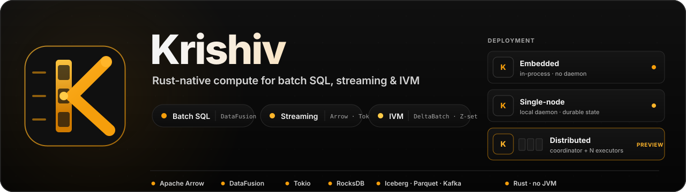

<p align="center">
  
</p>

<p align="center">
  <a href="https://crates.io/crates/krishiv"></a>
  <a href="https://pypi.org/project/krishiv/"></a>
  <a href="https://github.com/KrishivAI/krishiv/pkgs/container/krishiv"></a>
  <a href="https://github.com/KrishivAI/krishiv/blob/main/LICENSE"></a>
</p>

**Krishiv** is a Rust-native hybrid compute engine that unifies **batch SQL**, **streaming pipelines**, and **incremental view maintenance** under one Apache Arrow / DataFusion runtime. The same engine runs embedded in your process, as a single-node daemon, or as a distributed cluster.

---

> **⚠️ Pre-release — not for production use**
> Krishiv is under active development and has not yet reached its first stable release. APIs, storage formats, and wire protocols may change between versions. We recommend using Krishiv for evaluation, prototyping, and development purposes only. Please wait for the first stable release before deploying to production.

---

## Install

### Docker (recommended for getting started)

```bash
docker pull ghcr.io/krishivai/krishiv:latest
docker run --rm -it ghcr.io/krishivai/krishiv:latest sql --query "SELECT 42 AS answer"
```

Or run a single-node daemon with Flight SQL on `:50051`:

```bash
docker run -d --name krishiv -p 50051:50051 ghcr.io/krishivai/krishiv:latest local start
```

### Rust (crates.io)

```toml
[dependencies]
krishiv = "0.1"
```

For library use, add the specific crates you need:

```toml
[dependencies]
krishiv-api     = "0.1"   # Session, DataFrame, IncrementalDataFrame
krishiv-delta   = "0.1"   # DeltaBatch, IVM operators
krishiv-connectors = { version = "0.1", features = ["iceberg"] }
```

### Python (PyPI)

```bash
pip install krishiv
```

With optional extras:

```bash
pip install "krishiv[arrow]"       # PyArrow + Pandas
pip install "krishiv[iceberg]"     # Iceberg lakehouse support
pip install "krishiv[all]"         # everything
```

---

## Quick Start

### Batch SQL

**Rust** (`Session` is sync-friendly; every method has an `_async` twin)

```rust
use krishiv_api::Session;

fn main() -> krishiv_api::Result<()> {
    let session = Session::new();
    session.register_record_batches("orders", vec![orders_batch])?;

    let result = session
        .sql("SELECT status, COUNT(*) AS n FROM orders GROUP BY status")?
        .collect()?;
    println!("{}", result.pretty()?);
    Ok(())
}
```

**Python**

```python
import pyarrow as pa
import krishiv as ks

session = ks.Session()
session.register_record_batches("orders", [pa.record_batch(
    {"status": ["a", "b", "a"], "amount": [10.0, 25.0, 5.0]})])

result = session.sql("SELECT status, COUNT(*) AS n FROM orders GROUP BY status").collect()
print(result.pretty())
```

**CLI**

```bash
krishiv sql --query "SELECT 1 AS value"
krishiv explain --analyze --query "SELECT 1 AS value"
```

### Streaming

```python
import krishiv as ks

session = ks.Session()
events = session.sql("SELECT 1 AS n, 100 AS val, 1000 AS ts UNION ALL SELECT 1, 200, 2000")

windowed = (
    events.to_streaming()
    .with_event_time("ts")
    .key_by("n")
    .tumbling_window(1000)      # ms
)

async for batch in await windowed.execute_stream_async():
    print(batch)
```

Windowed SQL (`TUMBLE` / `HOP` / `SESSION`) over an unbounded source compiles
to the same operators; `krishiv stream` runs it from the CLI.

### Incremental View Maintenance (IVM)

```python
import pyarrow as pa
import krishiv as ks

session = ks.Session()
job = session.ivm("sales_pipeline")

class Revenue(ks.Schema):
    region: str
    total: float

job.register_view(
    "revenue",
    "SELECT region, SUM(amount) AS total FROM sales GROUP BY region",
    Revenue,
    is_materialized=True,
)

# Tick 1 — inserts
job.feed("sales", ks.DeltaBatch.from_inserts(
    pa.RecordBatch.from_pydict({"region": ["us", "eu"], "amount": [100.0, 200.0]})))
print(job.step().total_output_rows, job.snapshot("revenue"))

# Tick 2 — an update is a retraction plus an insertion
before = pa.RecordBatch.from_pydict({"region": ["us"], "amount": [100.0]})
after = pa.RecordBatch.from_pydict({"region": ["us"], "amount": [250.0]})
job.feed("sales", ks.DeltaBatch.from_update(before, after))
job.step()
print(job.snapshot("revenue"))          # us=250, eu=200

ckpt = job.checkpoint()                 # bytes; job.restore(ckpt) later
```

`examples/` has complete programs for every mode (`docs/guides/running-examples.md`).

---

## Deployment Modes

| Mode | When to use | Start |
|---|---|---|
| **Docker** | Quick eval, CI, sandbox | `docker run ghcr.io/krishivai/krishiv:latest local start` |
| **Embedded** | Library in your Rust/Python process | `Session::new()` |
| **Single-node** | Local daemon with Flight SQL | `krishiv local start` |
| **Distributed** | Coordinator + executor cluster | `krishiv clusterd` |
| **Kubernetes** | CRD-driven production deployment | `kubectl apply -k deploy/k8s/operator` |

---

## What's Inside

- **Apache Arrow** columnar memory — zero-copy between operators
- **DataFusion** SQL engine — full `SELECT`, `JOIN`, `GROUP BY`, window functions
- **Iceberg-first lakehouse** — catalog integration, Parquet read/write, snapshot isolation
- **Exactly-once semantics** — for certified source/sink/checkpoint combinations
- **Pluggable connectors** — Kafka, S3, Parquet, Iceberg (Delta and Hudi experimental)
- **Durable state** — RocksDB-backed keyed state with TTL and checkpoint/restore

---

## Crate Map

| Crate | Purpose |
|---|---|
| `krishiv` | CLI binary (`sql`, `explain`, `jobs`, `local start`) |
| `krishiv-api` | `Session`, `DataFrame`, `StreamingDataFrame`, `IncrementalDataFrame` |
| `krishiv-delta` | `DeltaBatch`, IVM operators, `IntegrateOp` |
| `krishiv-sql` | DataFusion SQL integration, DDL, catalog |
| `krishiv-connectors` | Source/sink SDK, Iceberg, Kafka, Parquet |
| `krishiv-runtime` | Embedded, single-node, distributed routing |
| `krishiv-scheduler` | Coordinator, metadata, task lifecycle |
| `krishiv-executor` | Executor process and task runner |
| `krishiv-dataflow` | Arrow operators, windows, joins, stateful ops |
| `krishiv-state` | RocksDB state, checkpoints, savepoints |
| `krishiv-shuffle` | Data-plane shuffle (memory, disk, object store) |
| `krishiv-python` | PyO3 Python bindings |

---

## Building from Source

```bash
# Check everything compiles
cargo check --workspace

# Run tests
cargo test --workspace --exclude krishiv-python

# Build single-node binary
cargo build --release -p krishiv --features single-node

# Build distributed + Kubernetes binary
cargo build --release -p krishiv --features full
```

### Docker build

```bash
# Fast local image (pre-built binaries)
docker build -f deploy/docker/Dockerfile.fast -t krishiv:local .

# Production image (multi-stage, ~50MB)
docker build -f deploy/docker/Dockerfile.prod -t krishiv:prod .
```

---

## Documentation

The architecture set in [`docs/architecture/`](docs/README.md) covers every
feature and every crate:

- [Overview](docs/architecture/00-overview.md) · [Execution modes](docs/architecture/01-execution-modes.md) · [SQL engine](docs/architecture/02-sql-engine.md) · [Planning and optimization](docs/architecture/03-planning-and-optimization.md)
- [Scheduler and coordinator](docs/architecture/04-scheduler-and-coordinator.md) · [Executor and data plane](docs/architecture/05-executor-and-data-plane.md) · [Shuffle](docs/architecture/06-shuffle.md) · [State, checkpoints, savepoints](docs/architecture/07-state-checkpoints-savepoints.md)
- [Streaming](docs/architecture/08-streaming.md) · [Incremental view maintenance](docs/architecture/09-incremental-view-maintenance.md) · [Connectors and lakehouse](docs/architecture/10-connectors-and-lakehouse.md) · [Public interfaces](docs/architecture/11-public-interfaces.md)
- [Security](docs/architecture/12-security.md) · [Observability](docs/architecture/13-observability.md) · [Deployment and durability](docs/architecture/14-deployment-and-durability.md) · [Configuration](docs/architecture/15-configuration.md)
- [Performance](docs/architecture/16-performance.md) · [Testing and quality](docs/architecture/17-testing-and-quality.md) · [Compatibility and versioning](docs/architecture/18-compatibility-and-versioning.md)

Also: [Engine contracts](docs/contracts/engine-semantics.md), [Connector SDK](docs/connector-sdk.md),
[Roadmap](docs/ROADMAP.md), [Compatibility](docs/COMPATIBILITY.md), [Contributing](CONTRIBUTING.md).

---

Krishiv is licensed under the [Apache License 2.0](LICENSE).
