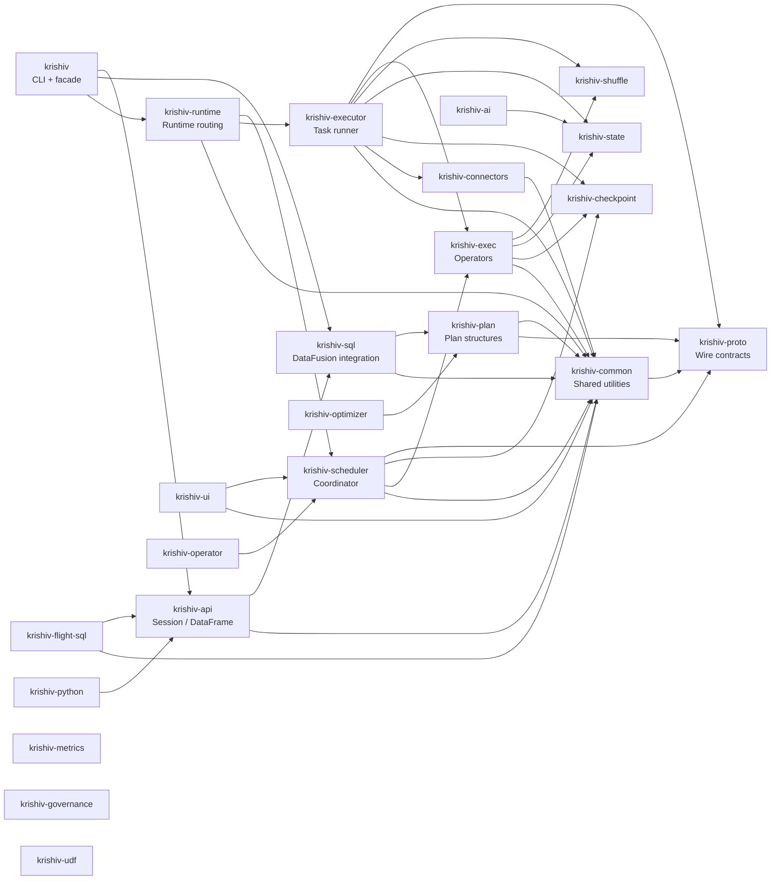
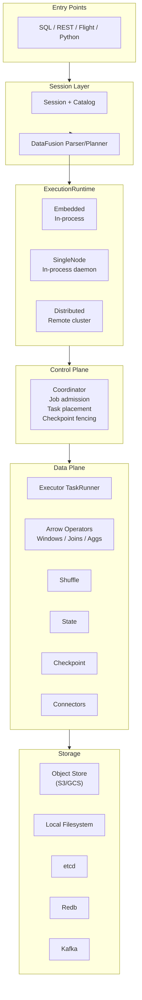
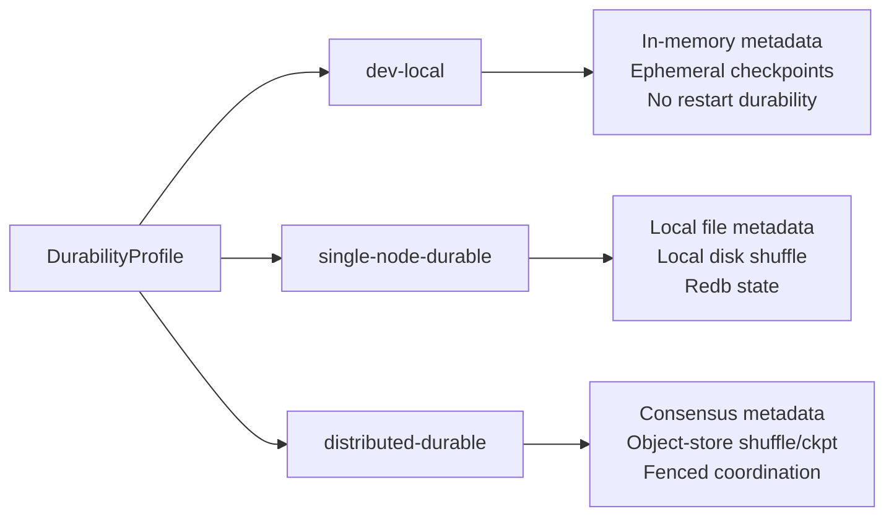

# Krishiv Architecture

```mermaid
block-beta
  columns 5

  block:EntryPoints:2:2
    columns 2
    a1("SQL CLI<br/><i>krishiv sql</i>")
    a2("REST API<br/><i>/api/v1</i>")
    a3("Python Bindings<br/><i>krishiv-python</i>")
    a4("Arrow Flight SQL<br/><i>krishiv-flight-sql</i>")
  end

  space:1

  block:ApiLayer:3:3
    columns 1
    b1("Session Builder")
    b2("DataFrame / Stream API")
    b3("Catalog Bridge<br/><i>krishiv-sql::catalog</i>")
  end

  block:Planning:2:3
    columns 2
    c1("DataFusion<br/>SQL Parser / Planner / Optimizer")
    c2("Krishiv Plan<br/><i>krishiv-plan</i><br/>Logical → Physical Plan")
  end

  block:Runtime:2:2
    columns 1
    d1("ExecutionRuntime")
    d2("Embedded | SingleNode | Distributed")
  end

  block:Scheduler:2:2
    columns 1
    e1("Coordinator<br/><i>krishiv-scheduler</i>")
    e2("Job / Task Lifecycle<br/>Metadata Store")
  end

  block:Executor:2:2
    columns 1
    f1("Executor Process<br/><i>krishiv-executor</i>")
    f2("TaskRunner / Assignment")
  end

  block:DataPlane:4:3
    columns 2
    g1("Arrow Operators<br/><i>krishiv-exec</i><br/>Windows, Joins, Stateful")
    g2("Shuffle<br/><i>krishiv-shuffle</i>")
    g3("State<br/><i>krishiv-state</i>")
    g4("Checkpoint<br/><i>krishiv-checkpoint</i>")
  end

  block:Connectors:2:2
    columns 2
    h1("Connectors<br/><i>krishiv-connectors</i><br/>Parquet / Kafka / S3 / Lakehouse")
  end

  block:Storage:3:2
    columns 3
    i1("Object Store<br/>S3 / GCS")
    i2("Local FS")
    i3("etcd")
    i4("Redb")
    i5("Kafka")
  end

  block:Observability:2:1
    columns 1
    j1("Metrics / Tracing<br/><i>krishiv-metrics</i>")
    j2("Governance<br/><i>krishiv-governance</i>")
  end

  block:Extras:2:1
    columns 2
    k1("UDF<br/><i>krishiv-udf</i>")
    k2("AI / RAG<br/><i>krishiv-ai</i>")
    k3("Schema Registry<br/><i>krishiv-connectors::schema_registry</i>")
    k4("K8s Operator<br/><i>krishiv-operator</i>")
  end

  EntryPoints --> ApiLayer
  ApiLayer --> Planning
  Planning --> Runtime
  Runtime --> Scheduler
  Scheduler --> Executor
  Executor --> DataPlane
  DataPlane --> Connectors
  Connectors --> Storage

  space:1

  block:Legend:2:4
    columns 2
    l1["Durability Profiles"]
    l2("dev-local | single-node-durable | distributed-durable")
  end
```

## Crate Dependency Flow



## Runtime Modes



## Durability Profile Selection


