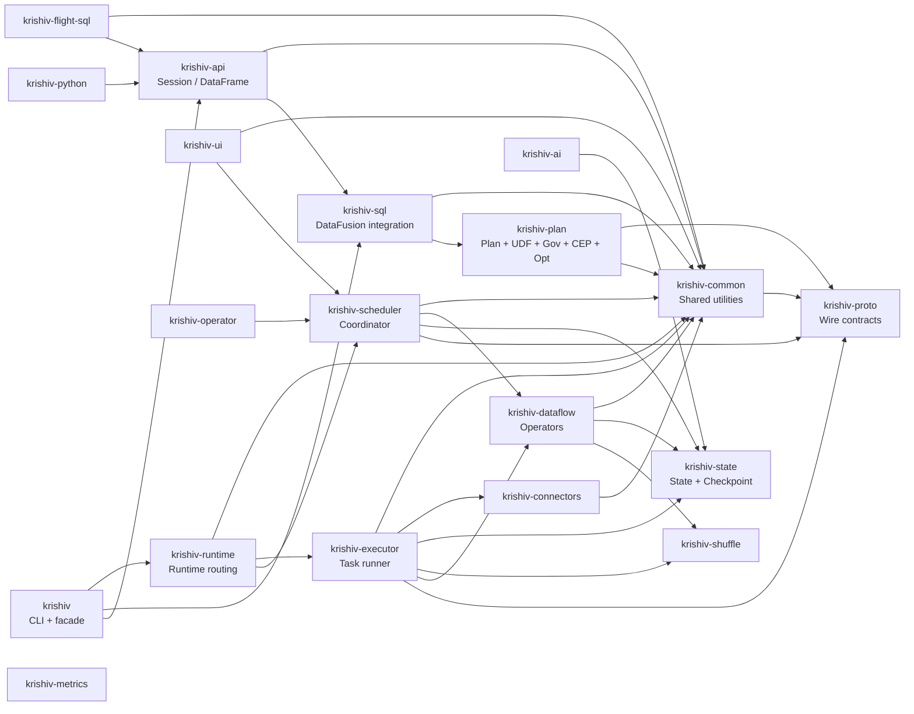

# Krishiv Architecture

## Layer Architecture

```mermaid
block-beta
  columns 5

  block:EntryPoints:2:2
    columns 2
    a1("SQL CLI<br/><i>krishiv sql</i>")
    a2("REST API<br/><i>/api/v1</i>")
    a3("Python Bindings<br/><i>krishiv-python</i>")
    a4("Arrow Flight SQL<br/><i>krishiv-flight-sql</i>")
  end

  space:1

  block:ApiLayer:3:3
    columns 1
    b1("SessionBuilder")
    b2("DataFrame / Stream API")
    b3("Catalog Bridge<br/><i>krishiv-sql::catalog</i>")
  end

  block:Planning:2:3
    columns 2
    c1("DataFusion<br/>SQL Parser / Planner / Optimizer")
    c2("PhysicalPlan<br/>UDF + Governance<br/>CEP + Optimizer<br/><i>krishiv-plan</i>")
  end

  block:Runtime:2:2
    columns 1
    d1("ExecutionRuntime")
    d2("InProcessBackend | RemoteBackend<br/><i>krishiv-runtime</i>")
  end

  space:1

  block:ControlPlane:3:2
    columns 1
    e1("Coordinator<br/>Job/Task lifecycle<br/>Checkpoint fencing<br/>Heartbeat monitoring<br/><i>krishiv-scheduler</i>")
    e2("Wire Protocol<br/><i>krishiv-proto</i> (gRPC + typed IDs)")
  end

  block:DataPlane:4:2
    columns 2
    f1("Executor TaskRunner<br/><i>krishiv-executor</i>")
    f2("Arrow Operators<br/><i>krishiv-dataflow</i>")
    f3("Shuffle<br/><i>krishiv-shuffle</i>")
    f4("State + Checkpoint<br/><i>krishiv-state</i>")
  end

  block:Connectors:2:2
    columns 2
    h1("Connectors<br/><i>krishiv-connectors</i><br/>Parquet / Kafka / S3")
    h2("Lakehouse / Schema Registry<br/>CDC / Vector sinks")
  end

  block:Storage:3:2
    columns 3
    i1("Object Store<br/>S3 / GCS")
    i2("Local FS")
    i3("etcd")
    i4("RocksDB")
    i5("Kafka")
  end

  EntryPoints --> ApiLayer
  ApiLayer --> Planning
  Planning --> Runtime
  Runtime --> ControlPlane
  ControlPlane --> DataPlane
  DataPlane --> Connectors
  Connectors --> Storage

  block:Observability:2:2
    columns 2
    j1("Metrics / Tracing<br/><i>krishiv-metrics</i>")
    j2("Governance / Audit<br/><i>krishiv-plan::governance</i>")
    j3("UDF contracts<br/><i>krishiv-plan::udf</i>")
    j4("AI / RAG<br/><i>krishiv-ai</i>")
  end

  block:Legend:2:5
    columns 2
    l1["Durability Profiles"]
    l2("dev-local | single-node-durable | distributed-durable")
  end
```

## Crate Dependency Flow



## Execution Flow

### Path A — Embedded Fast Path (inline SQL, skips coordinator)

Applies to pure `SELECT` queries in `RuntimeMode::Embedded` with `ExecutionPlacement::LocalInProcess`. The `InProcessStreamingRuntime::execute_batch_sql` checks `can_execute_inline()` — when true, the query goes directly to DataFusion without coordinator involvement.

```
Session::sql(query)
  └─ SqlEngine::sql(query)              [krishiv-sql, DataFusion parse]
  └─ DataFrame::collect_async()
       └─ runtime.collect_batch_sql()   [krishiv-runtime]
            └─ InProcessExecutionRuntime::collect_batch_sql()
                 └─ cluster.collect_batch_sql()
                      └─ can_execute_inline()?  YES (pure SELECT)
                           └─ execute_inline_sql() ──► DataFusion
                                                      └─ RecordBatch
```

### Path B — Coordinated Path (Embedded / SingleNode)

For DDL, streaming, shuffle-write, or any non-inline fragment. Uses `InProcessCluster` with in-memory channels bridged to a local `Coordinator` and `ExecutorTaskRunner`.

```
Session::sql(query)
  └─ PhysicalPlan                          [krishiv-plan]
  └─ InProcessCluster::execute_batch_sql()  [krishiv-runtime]
       └─ Coordinator::submit_job()          [krishiv-scheduler]
       └─ loop:
            ├─ launch_assigned_task_assignments()
            └─ ExecutorTaskRunner::run_assignment_with()  [krishiv-executor]
                 ├─ send_task_status(Running)
                 ├─ dispatch by fragment prefix:
                 │    sql:              ──► DataFusion
                 │    shuffle-write:    ──► ShuffleBackend        [krishiv-shuffle]
                 │    stream:tw/sw/ses  ──► ContinuousWindowExec  [krishiv-dataflow]
                 │    stream:loop:      ──► continuous drain cycle
                 │    connector-pipeline:─► Source → Sink         [krishiv-connectors]
                 │    local-parquet:    ──► file reads
                 └─ send_task_status(Succeeded/Failed)
       └─ evict_completed_job()
```

### Path C — Distributed Path

Uses `RemoteExecutionRuntime` with `FlightClientPool`. All actions go through Arrow Flight `DoAction` RPC to the coordinator's Flight SQL server.

```
Session::sql(query)
  └─ RemoteExecutionRuntime::collect_batch_sql()  [krishiv-runtime]
       └─ KrishivFlightAction::BatchSql { query, tables, is_streaming }
       └─ FlightClientPool::do_action()
            ═════ Arrow Flight DoAction ═══════► Coordinator Flight SQL
                                                 [krishiv-flight-sql / krishiv-scheduler]
              Action types:                       └─ Coordinator state machine
                krishiv.v1.batch_sql                    └─ gRPC task assignment
                krishiv.v1.bounded_window                     └─ ExecutorTaskRunner
                krishiv.v1.execute_plan                            [krishiv-executor]
                krishiv.v1.continuous.register
                krishiv.v1.continuous.push
                krishiv.v1.continuous.drain
                krishiv.v1.explain
                krishiv.v1.register_parquet
```

## Transport Boundaries

| Boundary | Protocol | Crate | Purpose |
|----------|----------|-------|---------|
| **Session → Runtime** | In-process call | `krishiv-runtime` | Embedded and SingleNode paths |
| **Runtime → Coordinator** | Arrow Flight DoAction | `krishiv-flight-sql`, `krishiv-proto` | Batch SQL, window ops, continuous stream lifecycle, explain |
| **Coordinator → Executor** | gRPC | `krishiv-proto` | Task assignment, status reporting, checkpoint ack, barrier injection, heartbeats |
| **Executor ↔ State** | In-process | `krishiv-state` | StateBackend snapshot/restore |
| **Executor ↔ Checkpoint** | In-process + filesystem | `krishiv-state::checkpoint` | Write/read epoch snapshots |
| **Executor ↔ Shuffle** | In-process + filesystem | `krishiv-shuffle` | Shuffle write/read between stages |
| **All → Wire** | gRPC protobuf | `krishiv-proto` | Typed IDs, fencing tokens, task specs, heartbeat messages |

## Fragment Dispatch Table

The executor dispatches task fragments by prefix matching against the fragment name string.

### Batch fragments (`execute_batch_fragment`)

| Prefix / Condition | Destination | Crate |
|---|---|---|
| `sql:` | DataFusion SQL execution | `krishiv-sql` |
| `window:` | Bounded window aggregation | `krishiv-dataflow` |
| `shuffle-write:` | Hash-partition to ShuffleBackend | `krishiv-shuffle` |
| `connector-pipeline:kafka-to-parquet` | Kafka → Parquet sink pipeline | `krishiv-connectors` |
| `shuffle_read` config (typed) | In-memory shuffle read (R4a) | `krishiv-shuffle` |
| `shuffle_write` config (typed) | In-memory shuffle write (R4a) | `krishiv-shuffle` |

### Streaming fragments (`execute_streaming_fragment`)

| Prefix | Destination | Crate |
|---|---|---|
| `sql:` (streaming) | Streaming SQL via `execute_stream()` | `krishiv-sql` |
| `stream:tw:` | Tumbling window | `krishiv-dataflow` |
| `stream:sw:` | Sliding window | `krishiv-dataflow` |
| `stream:ses:` | Session window | `krishiv-dataflow` |
| `stream:loop:` | Stateful continuous window loop | `krishiv-dataflow` |
| `stream-kafka:` | Kafka streaming source | `krishiv-connectors` |

### Input/output partition prefixes

| Prefix | Meaning |
|---|---|
| `local-parquet:` | Local filesystem Parquet source |
| `connector-parquet:` | Connector-provided Parquet source |
| `object-parquet:` | Object-store Parquet source |
| `object-parquet-sink:` | Object-store Parquet sink |
| `parquet-sink:` | Parquet sink |
| `memory-kafka:` | In-memory Kafka topic (tests) |

## Runtime Mode × Placement Matrix

`ExecutionRuntime` is selected by `build_execution_runtime()` based on the `(RuntimeMode, ExecutionPlacement)` pair:

| Mode | Placement | Runtime impl | Transport |
|------|-----------|-------------|-----------|
| Embedded | LocalInProcess | `InProcessExecutionRuntime::embedded()` | In-process |
| SingleNode | SingleNodeDaemon | `RemoteExecutionRuntime` (mode=SingleNode) | Flight SQL |
| Distributed | RemoteClusterRequired | `RemoteExecutionRuntime` (mode=Distributed) | Flight SQL + gRPC |
| Embedded | *other* | **Error** | — |
| SingleNode | LocalInProcess or RemoteClusterRequired | **Error** — use Embedded for in-process or SingleNodeDaemon for local daemon | — |
| Distributed | *other* | **Error** — RemoteClusterRequired is mandatory to prevent silent local fallback | — |

## Crate Requirements by Mode

Whether a crate is compiled into the binary depends on Cargo features (set at build time). Whether it is actively needed depends on the runtime mode. The table below covers both dimensions.

The default preset `local = [embedded, single-node]` compiles all core crates plus `krishiv-shuffle` and `krishiv-flight-sql`. To exclude those, use `cargo build --no-default-features --features embedded`.

| Crate | Embedded | SingleNode | Distributed | Feature gate |
|---|---|---|---|---|
| `krishiv-common` | R | R | R | always compiled |
| `krishiv-proto` | R | R | R | always compiled |
| `krishiv-plan` | R | R | R | always compiled |
| `krishiv-sql` | R | R | R | always compiled |
| `krishiv-api` | R | R | R | always compiled |
| `krishiv-runtime` | R | R | R | always compiled |
| `krishiv-scheduler` | R | R | R | always compiled |
| `krishiv-executor` | R | R | R | always compiled |
| `krishiv-dataflow` | R | R | R | always compiled |
| `krishiv-state` | R | R | R | always compiled |
| `krishiv-connectors` | O | O | O | base always compiled; kafka/iceberg/delta gated |
| `krishiv-ui` | O | O | O | always compiled; runtime-optional |
| `krishiv-metrics` | O | O | O | always compiled; runtime-optional |
| `krishiv-shuffle` | ✗ | R | R | `shuffle` feature |
| `krishiv-flight-sql` | ✗ | O | R | `flight-sql` feature |
| `krishiv-operator` | ✗ | ✗ | O | `k8s` feature |
| `krishiv-ai` | — | — | — | not a dep of the CLI crate |

**Legend:** R = required at runtime, O = optional at runtime (specific workloads), ✗ = excluded from binary by default features, — = unrelated.

Notes:
- Embedded mode with `--no-default-features --features embedded` produces a binary with only core crates (no shuffle, no Flight SQL, no operator).
- SingleNode needs `krishiv-flight-sql` only for the `SingleNodeDaemon` placement (Flight SQL server). `LocalInProcess` placement works without it.
- `krishiv-connectors` base crate provides Parquet, object-store, and lakehouse sources/sinks. Kafka, Iceberg, and Delta connectors are feature-gated and excluded from default features.
- `krishiv-ai` (text embeddings, vector DB sinks) is a standalone crate; the CLI does not depend on it.

## Durability Profile Spec

`DurabilityProfile` (`krishiv-common/src/durability.rs`) selects component backends:

| Profile | Metadata | Shuffle | State | Checkpoint | Restart | Multi-node | Fencing |
|---------|----------|---------|-------|------------|---------|------------|---------|
| `DevLocal` | In-memory | In-memory | In-memory | Ephemeral local | No | No | No |
| `SingleNodeDurable` | RocksDB (local file) | Local disk | RocksDB LSM | Local filesystem | Yes | No | No |
| `DistributedDurable` | etcd (consensus) | Tiered (local + object store) | RocksDB restored from checkpoints | Object store | Yes | Yes | Yes |

Resolved at startup from `KRISHIV_DURABILITY_PROFILE` env var via `resolve_durability_profile()`.

## Production Backends Per Deployment

Concrete backend selection for each supported deployment target. `RocksDbStateBackend`
(`krishiv-state`) is the only operator-state backend; incremental checkpointing
(`RocksDbIncrementalCheckpointer`) depends on RocksDB SST manifests.

| Deployment | Metadata | Shuffle | Operator State | Checkpoint | Leadership |
|---|---|---|---|---|---|
| Single-node (bare-metal / Docker / K8s single-replica) | `RocksDbMetadataStore` | `LocalDiskShuffleStore` | `RocksDbStateBackend` (file-backed) | `LocalFsCheckpointStorage` | `SingleNodeElection` |
| Distributed bare-metal | `EtcdMetadataStore` | `TieredShuffleStore` (local + S3/MinIO) | `RocksDbStateBackend` + checkpoint restore | `ObjectStoreCheckpointStorage` | `EtcdLeaseElection` |
| Distributed Docker Compose | `EtcdMetadataStore` | `TieredShuffleStore` + MinIO | `RocksDbStateBackend` (volume) | `ObjectStoreCheckpointStorage` + MinIO | `EtcdLeaseElection` |
| Distributed K8s direct | `EtcdMetadataStore` | `TieredShuffleStore` + object store | `RocksDbStateBackend` (PVC) | `ObjectStoreCheckpointStorage` | `EtcdLeaseElection` |
| Distributed K8s operator | `RocksDbMetadataStore` (PVC, single active replica) | `TieredShuffleStore` + object store | `RocksDbStateBackend` (PVC) | `ObjectStoreCheckpointStorage` | `K8sLeaseElection` |

Object-store URIs are `s3://` only (`open_shuffle_backend_from_uri`,
`open_checkpoint_storage_from_uri`): any S3-compatible endpoint works (AWS S3, MinIO,
GCS/Azure via their S3-compatible interop APIs); native `gs://` / `az://` schemes are
not implemented.

Enforcement (fail-closed at startup):

- The coordinator auto-selects the metadata backend from the durability profile when
  `--metadata-backend` is omitted: `dev-local` → in-memory, `single-node-durable` →
  RocksDB at `/var/lib/krishiv/metadata.db`, `distributed-durable` → **error** unless
  `--metadata-backend etcd` is explicit (`build_shared_coordinator_sync`). The
  coordinator's shuffle GC dir auto-defaults to `/var/lib/krishiv/shuffle` under
  `single-node-durable`.
- The executor rejects an `s3://` shuffle URI without `--shuffle-dir` under
  `distributed-durable`: object-store-only shuffle puts a remote round-trip on every
  partition read; the tiered backend is required (`apply_shuffle_defaults`).
- The executor's checkpoint URI is profile-driven when `--checkpoint-uri` is omitted:
  `dev-local` → `memory://`, `single-node-durable` →
  `file:///var/lib/krishiv/checkpoints`, `distributed-durable` → **error** — shared
  checkpoint storage must be explicit because node-local checkpoints break recovery
  on node loss (`apply_checkpoint_default`).
- The K8s operator row needs no etcd: `K8sLeaseElection` uses the cluster's native
  lease API for active-passive coordinator HA, and `RocksDbMetadataStore` on a PVC
  holds metadata as long as a single replica is active.

etcd backend caveats (`etcd_metadata.rs`): audit events are not persisted
(`append_event` is a no-op) and continuous-window snapshots are not stored in etcd —
streaming window-state recovery on distributed deployments relies entirely on
object-store checkpoints.

## Checkpoint Flow

```
Coordinator                    Executor
───────────                    ────────
CheckpointCoordinator::try_tick()
  └─ elapsed >= interval_ms
       └─ initiate()                 
            └─ barrier_dispatch        
                 └─ CheckpointBarrier ──► ExecutorBarrierService (gRPC)
                                           └─ SharedBarrierInjector
                                                └─ drain_pending_barriers()
                                                     └─ initiate_checkpoint_for_job()
                                                          └─ handle_initiate_checkpoint()
                                                               ├─ StateBackend::snapshot()
                                                               └─ CheckpointStorage::write_bytes()
                                                                    └─ CheckpointAckRequest (gRPC) ──►
       └─ receive_ack() ◄─────────────────────────────────────────┘
            └─ pending_acks >= expected_task_count
                 └─ commit_epoch()
```

Coordinator background loops (spawned by `SharedCoordinator::spawn_orchestration_loops()`):

| Loop | Interval | Function |
|------|----------|----------|
| Heartbeat tick | 5 s | `advance_heartbeat_tick()` — detect lost executors |
| Task launch | 500 ms | `drive_pending_task_launches()` — push assignments to executors |
| Barrier dispatch | 2 s | `drive_barrier_dispatches()` — send checkpoint barriers, collect acks |

## Key Architectural Decisions

1. **One runtime model across modes** — `ExecutionRuntime` trait with `InProcessExecutionRuntime` and `RemoteExecutionRuntime` backends. The same `Session` API works for embedded, single-node, and distributed. `RuntimeMode` and `ExecutionPlacement` are separate enums; invalid combinations are rejected at session build time.

2. **Coordinator owns job state** — Exactly one active coordinator per job (via fencing tokens). Executors are stateless workers. Task retries and recovery are coordinator-driven.

3. **Fragment-based dispatch** — Task fragments carry typed prefixes (`sql:`, `shuffle-write:`, `stream:tw:`, etc.) so `ExecutorTaskRunner` does not need a priori knowledge of every fragment kind. New fragment types need only a prefix registration.

4. **Durability profiles over feature flags** — Component selection (in-memory vs local file vs object store) is driven by runtime `DurabilityProfile`, not Cargo features. All profiles compile into the same binary.

5. **Shuffle, state, checkpoint, connectors behind trait abstractions** — Each has a trait (`ShuffleBackend`, `StateBackend`, `CheckpointStorage`, `Source`/`Sink`) with multiple implementations. Executor references them through `Arc<dyn Trait>`.

6. **Checkpoint is a submodule of state** — Both are durability/cold-storage domain. Checkpoint already depended on state; merging removed the circular-ish dependency and simplified the workspace.

7. **Plan is the unified rule/policy crate** — UDF contracts, governance/audit, CEP pattern matching, and optimizer rules all extend the plan layer. They share the same downstream consumers (`krishiv-sql`, `krishiv-scheduler`).

## Cross-Cutting Crates

| Crate | Role |
|---|---|
| `krishiv-common` | Shared utilities: durability profiles, hashing, async helpers, production env resolution. All crates depend on it. |
| `krishiv-proto` | All gRPC wire types, typed IDs (JobId, ExecutorId, TaskId, FencingToken), protobuf codegen. |
| `krishiv-metrics` | Prometheus metrics counters, tracing spans, observability report. Scheduler, executor, and UI consume it. |
| `krishiv-ai` | Text embeddings (fastembed), vector DB sinks (qdrant, pgvector), RAG pipeline helpers. |
| `krishiv-ui` | Axum web server with htmx templates: jobs list, executor detail, checkpoint timeline, DAG visualization, auto-refresh. |
| `krishiv-operator` | Kubernetes CRD controller, pod lifecycle manager, env-var allow-listing, bearer-token mounting. |
| `krishiv-bench` | Criterion benchmarks (TPC-H SF10, Nexmark). Not in default-members. |
